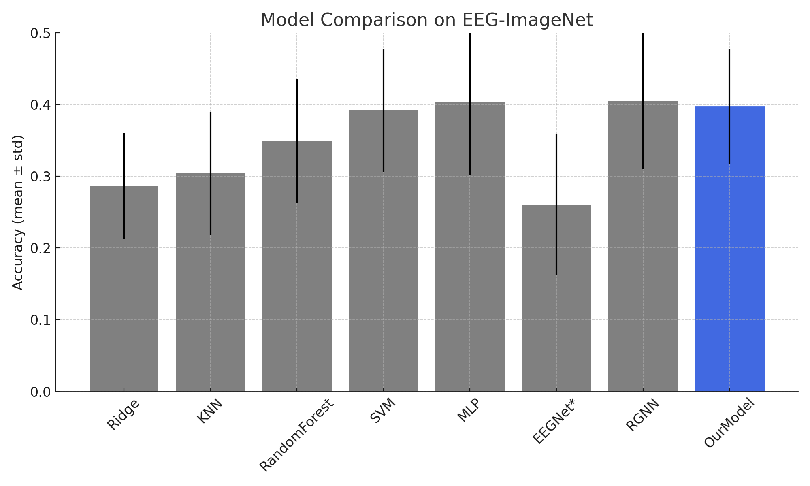

# EEG-ImageNet Decoding with Advanced EEGNet

This project focuses on decoding EEG signals collected from human participants viewing ImageNet visual stimuli. The core objective is to classify visual object categories from EEG recordings using a deep neural network tailored for this task.

## Dataset

We use the publicly available EEG-ImageNet Dataset:
https://github.com/Promise-Z5Q2SQ/EEG-ImageNet-Dataset

This dataset contains EEG signals recorded from 54 participants who viewed natural images from ImageNet. Each image is labeled according to its visual object class (80 total).

## Model Description

Our model is based on a customized EEGNet architecture:
- Uses depthwise temporal convolutions to capture frequency-domain features.
- Includes attention mechanisms to focus on task-relevant spatial-temporal information.
- Applies GELU activation and Layer Normalization for stable learning.
- Employs dropout for regularization and generalization.
- Trained with Focal Balanced Loss to address label imbalance in the dataset.
- Uses SWA (Stochastic Weight Averaging) starting from epoch 80 for better generalization.

## Results

With only half of the training data, our model achieved an accuracy of 39.72% on the EEG-ImageNet dataset. This outperforms a number of traditional and deep learning baselines.

## Comparison Chart

The bar chart below compares our model to other common classifiers tested on the same dataset:

## Importance of EEG Decoding

EEG decoding enables the interpretation of brain activity and the development of:
- Brain-computer interfaces
- Cognitive monitoring systems
- Neural feedback and diagnostics

By advancing EEG decoding methods, we enable more robust and scalable neural AI systems that can work in real-world scenarios.

